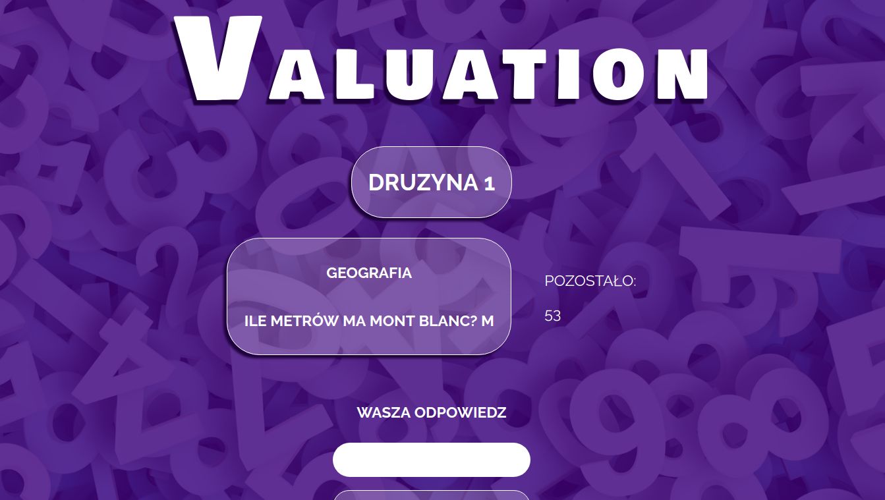

<h1> Valuation </h1>

<h3> General Info </h3>

 The game I am currently working on. 

 The goal of the game is to estimate the score by 3 teams.

 All answers are numbers. 

 The point is awarded to the team whose answer was the closest to the correct result.

 Ultimately, I would like the game to be available for mobile devices.

<h3>Technologies</h3>
<ul>
    <li> React.js </li>
    <li> JSX </li>
    <li> SASS </li>
    <li> JSON server </li>
    <li> Webpack </li>
</ul>

<h3>Setup</h3>

$ git clone https://github.com/pmatyjas/Valuation.git

$ cd Valuation

$ npm install

$ npm run start

Use another console to see questions

$ json-server --watch ./js/questions.json

<h3>Screenshot</h3>
 
